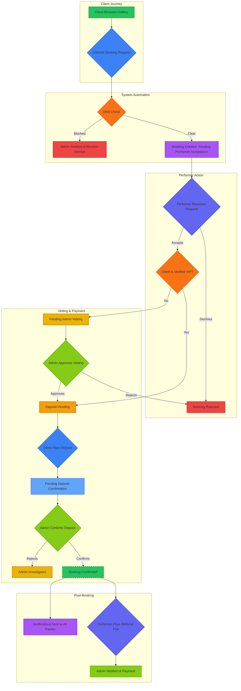

# Flavor Entertainers - Business & Technical Overview

## 1. Introduction: What is Flavor Entertainers?

Flavor Entertainers is a premium, web-based platform designed to connect clients in Western Australia with professional, vetted entertainers. Our mission is to provide a secure, compliant, and seamless booking experience that automates agency logistics from first contact to final payment.

The system is built with a focus on three core pillars: **unmatched performer safety**, **intelligent operational efficiency**, and **a premium user experience**.

---

## 2. The Competitive Advantage

Flavor Entertainers is not just a booking website; it's an end-to-end business automation platform. It's engineered to solve the industry's biggest challenges—performer safety, administrative overhead, and client trust—transforming them into your agency's greatest competitive advantages.

*   **Proactive Performer Safety:** Instead of reacting to incidents, we prevent them. Our proprietary, admin-vetted **'Do Not Serve' List** automatically blocks applications from flagged individuals *before* a performer is ever notified.

*   **Intelligent Vetting Automation:** A multi-layered workflow (Performer Acceptance -> Admin Vetting -> Secure Deposit) filters out low-quality leads, saving everyone time and ensuring only serious, legitimate clients proceed.

*   **Automated VIP Client Recognition:** The system identifies and rewards trusted, returning clients with a faster, frictionless booking experience, automatically bypassing repetitive verification steps to build loyalty.

*   **Closed-Loop Financial Automation:** The platform manages the complete financial lifecycle of a booking, from securing the client's deposit to facilitating the performer's referral fee payment, creating a self-sustaining and easy-to-track revenue cycle.

*   **Total Administrative Agility:** A central dashboard gives administrators unparalleled control to manage exceptions on the fly—override performer decisions, reassign bookings, and monitor the entire ecosystem, with all notifications handled automatically.

---

## 3. The End-to-End Booking Workflow

This diagram illustrates the automated, multi-stage process that ensures security and efficiency for every booking.

---

## 4. Feature Deep Dive: A Benefit-Oriented Breakdown

### For the Agency Owner (The Admin Advantage)
*   **Feature:** Centralized Booking Management.  
    **Benefit:** A single source of truth for all applications. Dramatically reduces admin time, prevents double-bookings, and provides instant insight into business velocity.

*   **Feature:** Multi-Layered Vetting Workflow.  
    **Benefit:** Automates quality control. Ensures performers only receive serious, pre-screened requests, boosting their confidence and saving agency time.

*   **Feature:** DNS List Curation & Control.  
    **Benefit:** Upholds the highest safety standards. The admin has the final say on all 'Do Not Serve' submissions, maintaining the integrity of this critical safety feature.

*   **Feature:** Financial Tracking Dashboard.  
    **Benefit:** Simplifies accounting. Get a clear, at-a-glance view of bookings awaiting deposit, those pending confirmation, and confirmed payments.

*   **Feature:** Automated Revenue Tracking (Referral Fees).  
    **Benefit:** Eliminates manual commission collection. The system prompts performers to pay their referral fees post-booking and notifies the admin upon receipt, closing the financial loop automatically.

*   **Feature:** Performer Impersonation.  
    **Benefit:** Provides white-glove support and oversight. Troubleshoot issues by seeing exactly what a performer sees, without needing their login credentials.

*   **Feature:** Dynamic Reassignment.  
    **Benefit:** Unprecedented operational flexibility. Instantly reassign a booking to another performer with a single click; the system handles notifying all parties automatically.

*   **Feature:** Centralized Communications Log.  
    **Benefit:** Creates a complete audit trail. Never miss a critical system alert or performer message.

### For the Talent (The Performer Advantage)
*   **Feature:** Proactive Safety Net.  
    **Benefit:** Unmatched peace of mind. Requests from individuals on the 'Do Not Serve' list are blocked before they ever reach the performer's dashboard.

*   **Feature:** Personalized & Focused Dashboard.  
    **Benefit:** Eliminates noise and confusion. Performers only see the bookings, communications, and actions relevant to them.

*   **Feature:** Control Over Availability.  
    **Benefit:** Puts them in the driver's seat of their schedule. A simple toggle lets them go from "Available" to "Busy" or "Offline," instantly updating the public gallery.

*   **Feature:** Seamless Referral Fee Payment.  
    **Benefit:** Simplifies their business obligations. A clear "Financials" section on each booking and a simple payment modal make settling agency fees transparent and hassle-free.

*   **Feature:** Empowered to Report.  
    **Benefit:** Gives them a voice in their own safety. The ability to submit to the 'Do Not Serve' list shows the agency values their feedback and well-being.

*   **Feature:** Instant Automated Notifications.  
    **Benefit:** Work smarter, not harder. Real-time alerts for new requests and confirmed bookings mean less time checking the dashboard and faster response times.

### For the End User (The Client Advantage)
*   **Feature:** Premium, Transparent Experience.  
    **Benefit:** Builds immediate trust and confidence. A clean interface, clear pricing, and transparent communication at every step elevates the brand above competitors.

*   **Feature:** Dual Booking Modes.  
    **Benefit:** Caters to every need. Whether planning months in advance or seeking immediate entertainment, the "Available Now" and "Book for Future" galleries provide tailored options.

*   **Feature:** Rewarded Loyalty (VIP Workflow).  
    **Benefit:** Feels exclusive and convenient. Returning, verified clients enjoy a frictionless re-booking process, encouraging repeat business.

*   **Feature:** Clear Status Updates.  
    **Benefit:** Reduces booking anxiety. Clients are always informed about the status of their request, from performer acceptance to final confirmation.

*   **Feature:** Secure & Professional Process.  
    **Benefit:** Reassurance of quality. The presence of a clear vetting and ID verification process signals a legitimate, high-end service that prioritizes safety for everyone involved.

---

## 5. Technology & Cost of Ownership

The platform is engineered for scalability and efficiency, resulting in a remarkably low total cost of ownership.

*   **Technology Stack:**
    *   **Frontend:** React & TypeScript for a robust, modern user interface.
    *   **Styling:** TailwindCSS for a responsive, clean design.
    *   **Backend:** Supabase for database, authentication, and secure file storage (using Row Level Security).
    *   **Hosting:** Designed for Vercel/Netlify for high-performance, global static hosting.

*   **Estimated Running Costs:**
    *   **Core Infrastructure (Supabase & Vercel):** The platform can run on highly efficient serverless architecture. Initial costs for a live, production-ready environment start at approximately **$25-30/month**.
    *   **Third-Party APIs (e.g., Twilio for SMS):** Costs are usage-based and scale directly with booking volume, typically ranging from **$10-50+/month** for a small to medium-sized agency.
    *   **Conclusion:** The total core technology cost to run this enterprise-grade platform can be under **$100/month**, making it an incredibly cost-effective solution.

---

## 6. 60-Second Sales Video Script

**Target Audience:** Entertainment agency owners, entrepreneurs, investors.
**Goal:** To sell the platform as a powerful, turnkey business solution.

**(Video Length: 60 seconds)**

---

**(0-5 seconds) - The Problem**

*   **Visuals:** Fast cuts of frustrating admin work. A hand scribbling in a messy appointment book. A phone ringing off the hook. A spreadsheet with conflicting data. A performer looking stressed, double-booked.
*   **Voiceover (VO):** (Confident, direct) *Running an entertainment agency is chaos. Manual bookings, constant calls, and performer safety risks drain your time and profits.*

---

**(5-15 seconds) - The Old Way vs. The New Way**

*   **Visuals:** Split screen. Left: The chaos from before. Right: The sleek, calm Admin Dashboard of Flavor Entertainers. A cursor glides over the dashboard, managing bookings with a single click.
*   **VO:** *You're stuck managing logistics instead of growing your business. What if you could automate the chaos and focus on what matters?*

---

**(15-30 seconds) - The Solution: Competitive Advantage**

*   **Visuals:** Dynamic, animated icons pop up on screen with keywords as the VO speaks.
    *   `Shield Icon`: "Automated Safety" - shows the 'Do Not Serve' list blocking a booking.
    *   `Magnifying Glass Icon`: "Intelligent Vetting" - shows the performer -> admin -> deposit workflow.
    *   `Dollar Sign with Arrows`: "Closed-Loop Financials" - shows deposit coming in, referral fee going out.
*   **VO:** *Introducing the Flavor Entertainers Platform. It's your complete business operating system, built on **Unmatched Safety** that automatically blocks problem clients, **Intelligent Vetting** that pre-screens every lead, and **Closed-Loop Financials** that automate your entire revenue cycle.*

---

**(30-45 seconds) - The Technology & Cost**

*   **Visuals:** A clean, animated graphic shows logos for Supabase and Vercel. A simple cost graphic appears: a slider shows "Low Startup Cost" and text animates in: "Starts under $100/month".
*   **VO:** *Built on a modern, scalable tech stack, our platform is engineered for growth. And the best part? The cost of ownership is incredibly low. With a serverless backend, your core technology costs can start at **less than a hundred dollars a month**. It's enterprise power on a startup budget.*

---

**(45-55 seconds) - The Vision**

*   **Visuals:** Sweeping shots of the platform's UI on different devices. Happy performers, satisfied clients, and a relaxed business owner looking at a graph of increasing profits.
*   **VO:** *Stop managing logistics, start scaling your brand. You'll reduce admin overhead by up to 80%, give your performers the safety they deserve, and deliver a premium, professional experience that commands higher prices and builds unshakable client loyalty. This is the turnkey solution your agency needs to dominate the market.*

---

**(55-60 seconds) - Call to Action**

*   **Visuals:** The Flavor Entertainers logo animates onto the center of the screen. A clear URL and contact email appear below.
*   **VO:** *Ready to transform your agency? Visit our site to schedule a full demo and discuss licensing opportunities.*
*   **Text on Screen:** **FLAV🍑R** Entertainers Platform | yourwebsite.com | sales@youremail.com