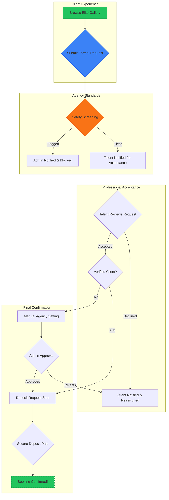

# Flavor Entertainers - Agency Operations Overview

## 1. Introduction: What is Flavor Entertainers?

Flavor Entertainers is Perth's most prestigious agency for professional entertainment. Our service connects discerning clients with vetted, elite talent through a workflow that prioritizes discretion, safety, and seamless execution.

Our operations are built on three core pillars: **Unmatched Performer Safety**, **Operational Reliability**, and **A Premium Client Experience**.

---

## 2. Our Competitive Advantage

We are more than just a booking directory; we are a managed entertainment ecosystem. We solve the industry's biggest challenges—reliability and safety—to provide an exceptional experience for both talent and clients.

*   **Proactive Safety Standards:** We maintain a strictly curated, private 'Do Not Serve' list. We block problem requests before a performer is ever notified, ensuring our talent feels protected and valued.

*   **Professional Vetting:** Every request undergoes a multi-layered review. We filter out low-quality leads and verify event details to ensure our entertainers only work with serious, professional clients.

*   **Trusted Client Recognition:** We identify and reward our returning clients with a faster, frictionless booking process, bypassing repetitive verification for those with a proven history of excellence.

*   **Integrated Financial Handling:** We manage the entire financial lifecycle, from securing client deposits via instant PayID to facilitating agency referral fees. This ensures transparency and security for all parties.

*   **Total Administrative Oversight:** Our central hub allows agency managers to monitor all active requests, reassign talent when necessary, and maintain the high standards our brand is known for.

---

## 3. The Professional Booking Lifecycle

This multi-stage process ensures every booking meets our elite agency standards.

```mermaid
graph TD
    subgraph Client Experience
        A[Browse Elite Gallery] --> B{Submit Formal Request};
    end

    subgraph Agency Standards
        B --> C{Safety Screening};
        C -- Flagged --> D[Admin Notified & Blocked];
        C -- Clear --> E[Talent Notified for Acceptance];
    end

    subgraph Professional Acceptance
        E --> F{Talent Reviews Request};
        F -- Declined --> G[Client Notified & Reassigned];
        F -- Accepted --> H{Verified Client?};
    end

    subgraph Final Confirmation
        H -- No --> I[Manual Agency Vetting];
        I --> J{Admin Approval};
        J -- Rejects --> G;
        J -- Approves --> K[Deposit Request Sent];
        H -- Yes --> K;
        K --> L{Secure Deposit Paid};
        L --> M[Booking Confirmed!];
    end

    style A fill:#22c55e,stroke:#16a34a,stroke-width:2px
    style B fill:#3b82f6,stroke:#2563eb,stroke-width:2px
    style C fill:#f97316,stroke:#ea580c,stroke-width:2px
    style M fill:#22c55e,stroke:#16a34a,stroke-width:4px,stroke-dasharray: 5 5
```

---

## 4. Benefit-Oriented Service Features

### For Our Agency Managers
*   **Centralized Oversight:** Manage all bookings from a single hub. Reduce admin time and ensure zero double-bookings.
*   **Quality Control:** Automated screening ensures you only spend time on high-quality, legitimate leads.
*   **Financial Visibility:** Instantly track deposits and pending agency fees for a clear picture of business health.

### For Our Talent
*   **The Safety Net:** Work with peace of mind. We block problem clients automatically and verify every location.
*   **Focused Dashboard:** No noise. Talent only sees their own gigs, messages, and confirmed schedules.
*   **Instant Notifications:** Receive gig alerts via WhatsApp instantly so you can accept and lock in dates immediately.

### For Our Clients
*   **Premium Interface:** A clear, transparent experience from first selection to final arrival.
*   **Real-Time Status:** Stay informed at every step of the vetting and confirmation process.
*   **Secure Payments:** Use instant, secure methods like PayID for a professional and hassle-free transaction.

---

## 5. Excellence in Operation

Flavor Entertainers is designed for scalability and professional excellence. By automating the administrative "busy work," we allow our team to focus on what truly matters: **curating the best talent in Western Australia.**
